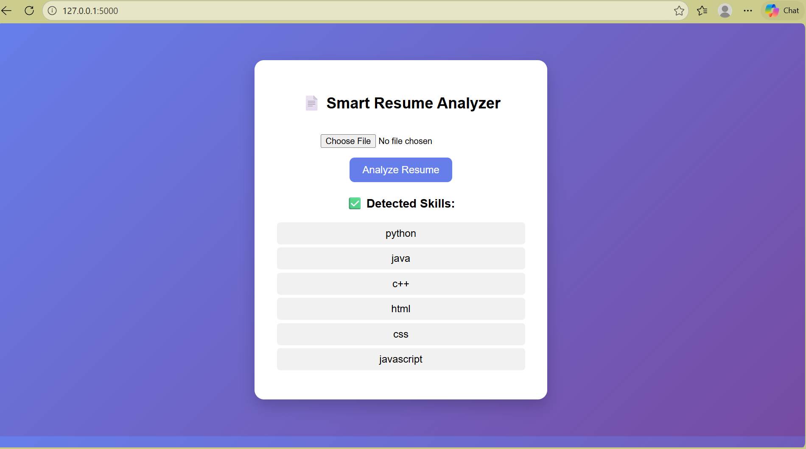

# Resume Analyzer

## Description

This project is a Resume Analyzer built using Python.
It analyzes resumes and extracts useful information like skills and keywords.

## Features

* Upload and analyze resumes
* Extract important keywords
* Simple interface

## Technologies Used

* Python
* Flask
* HTML / CSS

## Output Screenshot

## How to Run

1. Open project folder
2. Run:
   python app.py
3. Open browser

## Author

Vanimina Bhanu Shankar
# resume-analyzer